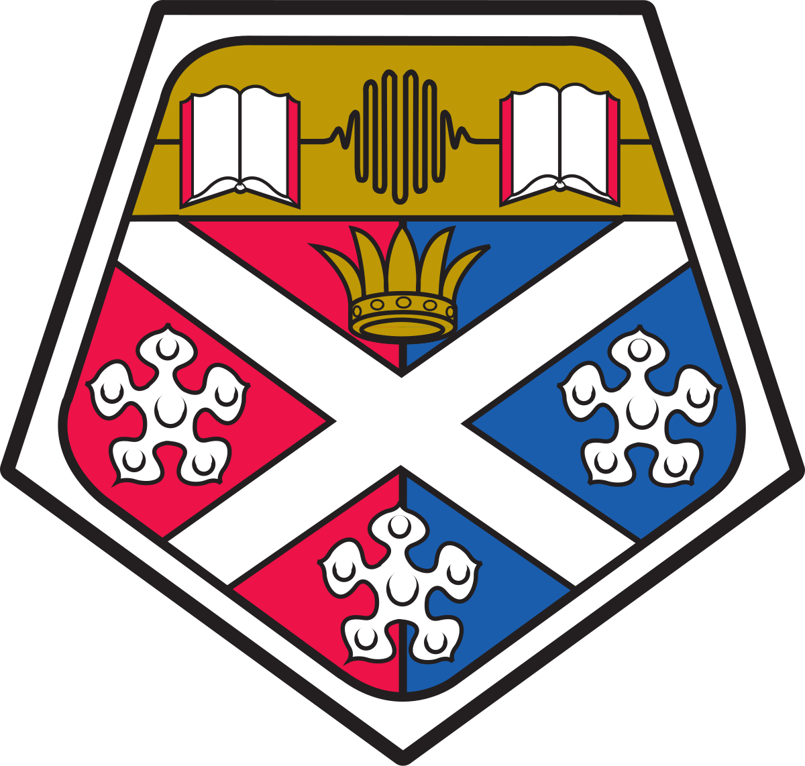

# SDR Application on Enterprise RFSoC Platform 

### EEE 4th Year Individual Project – University of Strathclyde 


## Overview
This project explores the implementation of a Software-Defined Radio (SDR) application on an enterprise-grade RFSoC (Radio Frequency System-on-Chip) platform, the BittWare RFX-8440. The objective is to leverage the capabilities of RFSoC to process high-speed wireless signals for applications in communications, signal processing, and embedded systems.

## Features
- Implementation of an SDR system on RFSoC
- Custom Tx and Rx component designed

### Hardware
- BittWare RFX-8440 with gen3 RFSoC from AMD
- Xilinx RFSoC 2x2 development board used for parallel development

### Software
- AMD Vivado Design Suite
- Vitis Model Composer
- PYNQ and PetaLinux

## Clone this repository
   ```sh
   git clone https://github.com/fraseroregan77/FO-RFSoC-4YP.git
